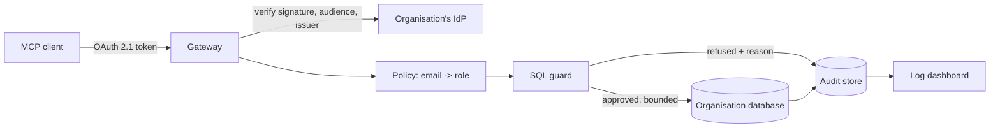

# MCP Data Gateway

[](https://github.com/nadim-raj/mcp-data-gateway/actions/workflows/ci.yml)
[](https://www.python.org/downloads/)
[](LICENSE)

**A governed MCP server for organisational databases.** An organisation connects a database, people authenticate through the organisation's own identity provider, and questions are answered under role-based limits with every decision logged.

> **Status:** in progress. The policy model and SQL guard are implemented and tested. Identity, the MCP server, the audit store and the dashboard are next — see [Roadmap](#roadmap).

---

## The problem this is built around

Connecting a language model to a company database is easy. Every published analysis of MCP database incidents lands on the same cause: a tool that accepts free-form SQL against a connection with more privilege than the question needed. In one documented case an instruction hidden inside a support ticket caused an agent holding service-role credentials to read an entire table.

The usual mitigation — a read-only database user — is necessary and not sufficient. A read-only role still permits reading every row of every table it can see, which is precisely the exfiltration case.

So the interesting part of this project is not the connection. It is everything that has to refuse.

## Design



**Identity is delegated.** Under the MCP specification (revision 2026-07-28) a server is an OAuth 2.1 *resource server*: it validates tokens and never issues them. Each organisation points the gateway at its own provider — Google Workspace, Okta, Entra — and the gateway verifies the token's signature, issuer and audience, then matches the verified email against that organisation's allowlist. No password ever reaches this service, and no token is ever forwarded upstream.

**Authorisation is an allowlist.** A role names the tables it may read, optionally the columns, a row cap and a timeout. A denylist answers "what have we thought to forbid"; an allowlist answers "what have we decided to permit", and only the second holds when the thing on the other side is a model improvising queries.

**Statements are parsed, not pattern-matched.** The guard builds an abstract syntax tree and inspects it. Regular expressions over SQL are defeated by comments, nested sub-selects, unions and whitespace; an AST is defeated by none of those, because it describes what a statement *does* rather than how it is spelled.

## What the guard refuses

| Refused | Why it matters |
|---|---|
| Anything that is not a single SELECT | Writes, DDL and multi-statement payloads never reach the database |
| A write hidden inside a CTE | `WITH x AS (INSERT ...) SELECT * FROM x` parses as a read |
| `SELECT ... INTO` | Writes a table while looking like a read |
| A second statement after a comment | The classic injection shape |
| Tables outside the role | Including via `UNION` and sub-selects, which is how scope is usually escaped |
| System catalogues | `information_schema`, `pg_catalog`, `sqlite_master` — standard reconnaissance |
| Functions that leave the engine | `pg_read_file`, `dblink`, `pg_sleep` and similar |
| Columns the role may not read | Checked on qualified and unqualified references |
| `SELECT *` on a column-restricted table | It cannot be proven safe, so it is refused with an instruction to name the columns |

Anything it cannot prove safe is refused with a reason. A wrong refusal costs a confused user; a wrong approval costs a breach.

Approved statements are **rewritten, not just approved**: a missing limit is added and an oversized one lowered, so no query can return an unbounded result.

## Run the tests

```bash
uv venv --python 3.12
uv pip install -e ".[dev]"
uv run pytest -q
```

## Roadmap

- [x] Policy model — organisations, roles, table and column rules
- [x] SQL guard — AST validation, scope enforcement, result bounding
- [ ] Identity — JWT verification, audience and issuer binding, email allowlist
- [ ] MCP server — Streamable HTTP, protected resource metadata, curated tools
- [ ] Audit store — every decision with its reason, PII redacted
- [ ] Log dashboard — who asked what, under which role, allowed or denied
- [ ] Demo organisation with seeded synthetic data

## Licence

MIT. No real data, credentials or customer information belongs in this repository.
